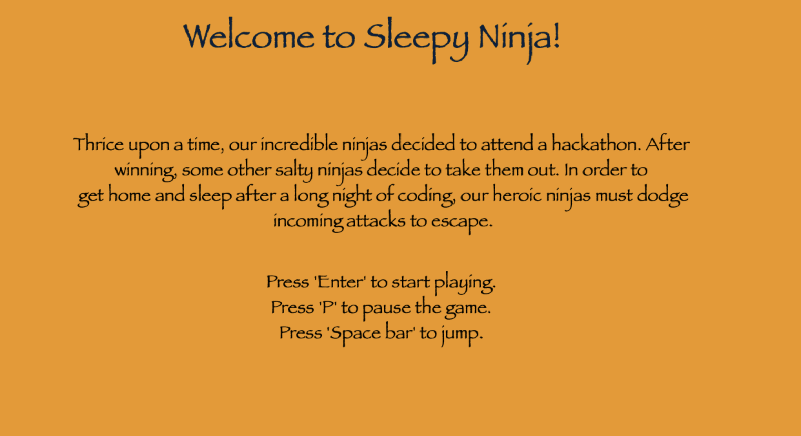
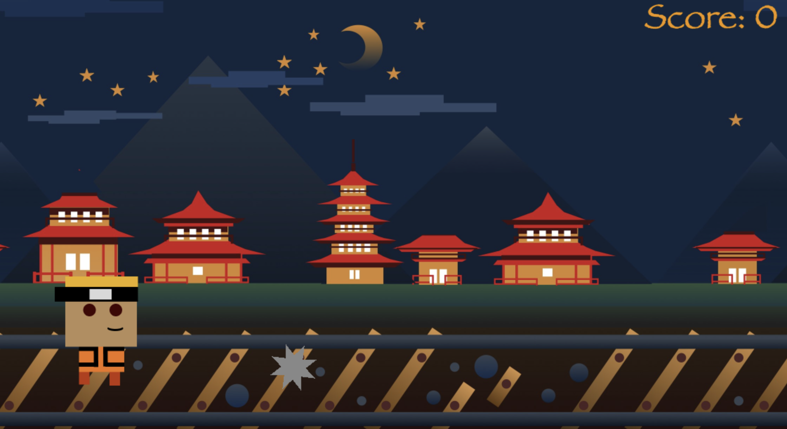
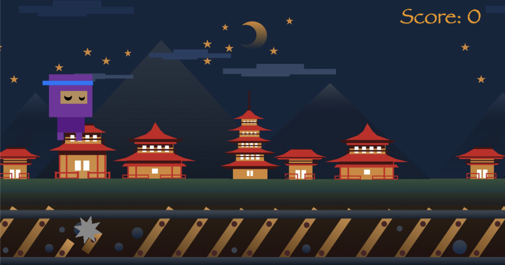
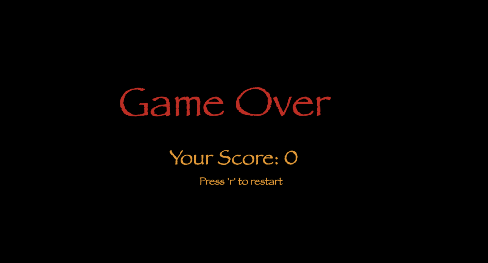
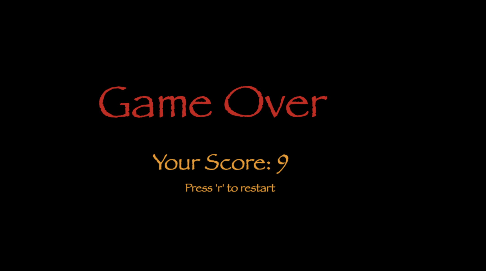

# nwPlus-Hackathon

<h1>Sleepy Ninja</h1>

In this game, the player must avoid obstacles as long as possible while trying to achieve the maximum score. If they are hit by an obstacle, they lose. 

<h3> To be implemented: </3>
<ol>
- make player be affected by gravity
- make acceleration non-constant
- make player and and obstacle images
- make player and obstacle shapes
- overlay player images and obstacles
- add more to background
- add increasing score
- add death condition
- add death message
</ol>

<h2>Images For The Game</h2>

